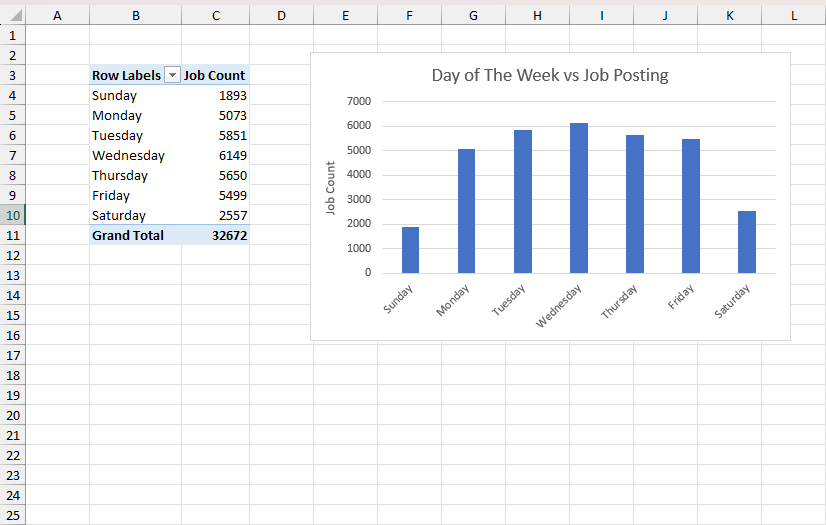
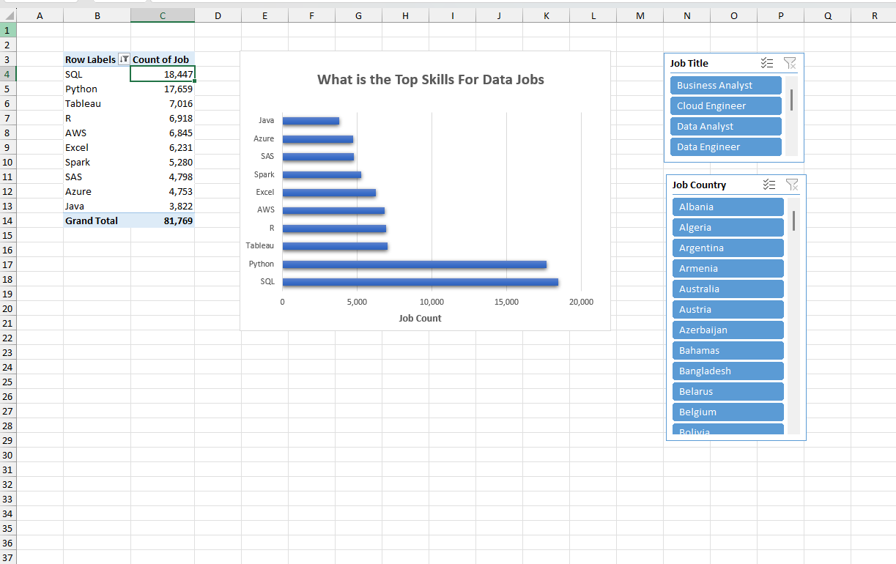
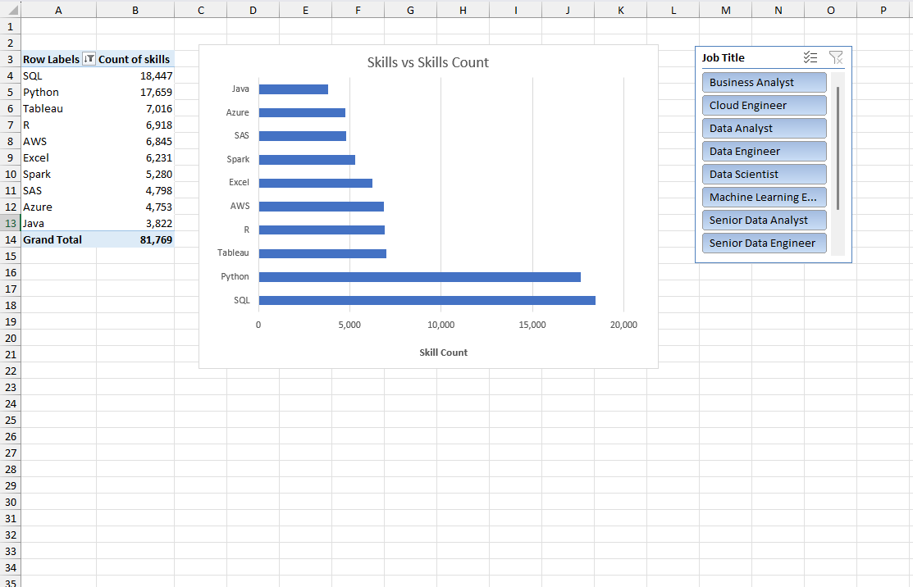
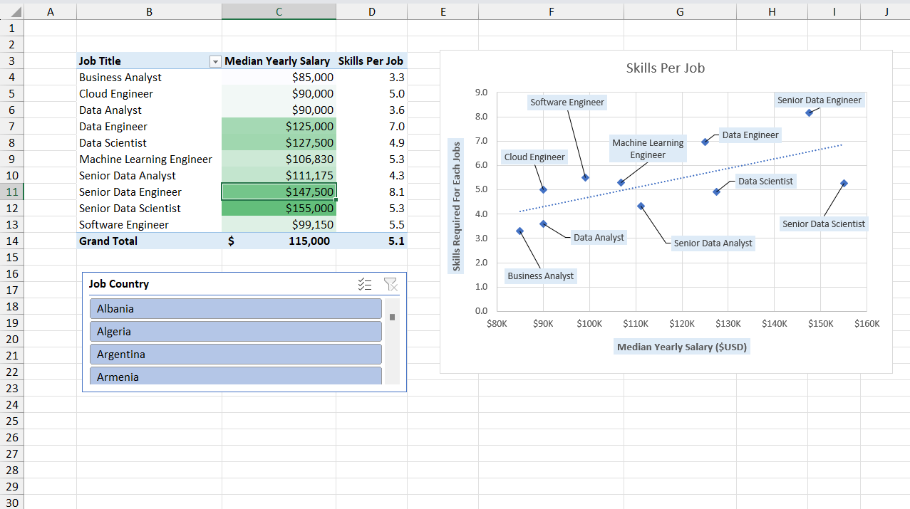
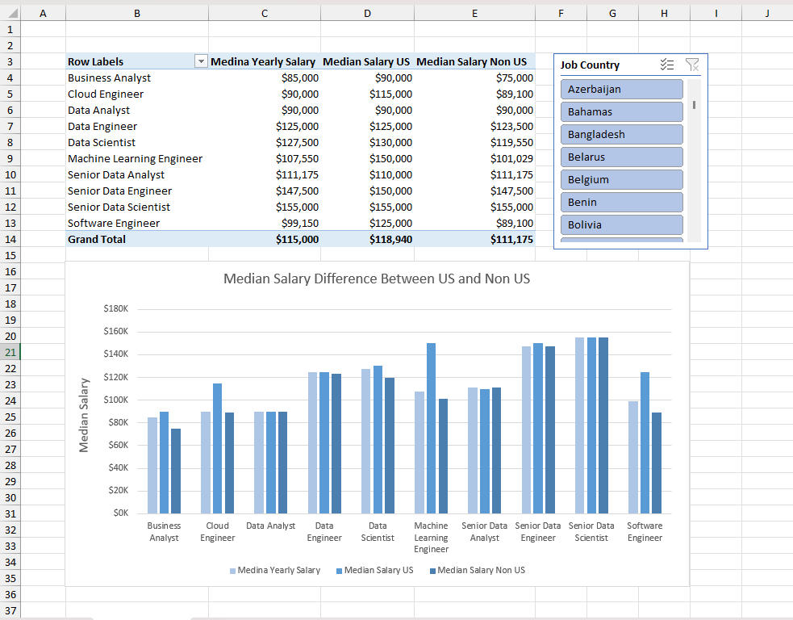

# 📊 Global Job Market Data Analysis Portfolio (2023)
**Excel · Power Query · Power Pivot · DAX · Interactive Dashboards**

---

##  Overview
This repository showcases a collection of **Excel-based job market analyses** built using **Power Query**, **Power Pivot**, and **DAX**.  
The projects focus on **skill demand, salary trends, job posting behavior, and cross-country comparisons**, delivered through **interactive dashboards**.

Each analysis demonstrates **real-world data analyst workflows**, including ETL, data modeling, advanced calculations, and professional data visualization.

---

## 🛠 Core Skills Demonstrated
- Data Cleaning & Transformation (ETL)
- Power Query (Advanced)
- Power Pivot Data Modeling
- DAX Explicit Measures
- CROSSFILTER for complex relationships
- Pivot Tables & Pivot Charts
- Interactive Slicers (Country, Job Title, Skills)
- Data storytelling & business insight generation

---

## 🔎 Analysis 1: Job Posting Trends by Day of the Week

### Objective
Understand how **job posting activity varies across weekdays** to identify recruiter posting patterns.

### Methodology
- Cleaned posting date data using **Power Query**
- Aggregated job counts by weekday using **Pivot Tables**
- Visualized trends with a **Column Chart**

### Visualization Design
- **Chart Type:** Column Chart  
- **X-Axis:** Day of the Week (Monday–Sunday)  
- **Y-Axis:** Job Posting Count  

### Dashboard Preview

  

---

## 🌍 Analysis 2: Global Skill Demand by Job Role

### Objective
Analyze **job demand by skill** and understand how required skills vary across **job titles and countries**.

### Methodology
- Cleaned and structured job–skill data using **Power Query**
- Modeled relationships using **Power Pivot**
- Built Pivot Tables with dynamic filtering

### Visualization Design
- **Chart Type:** Bar Chart  
- **X-Axis:** Job Count  
- **Y-Axis:** Skills  
- **Slicer:** Job Country, Job Title
 

### Dashboard Preview

  

---

## 🧩 Analysis 3: Skill Count Distribution by Job Title

### Objective
Understand how **different job roles are associated with varying skill requirements**.

### Methodology
- Processed data using **Power Query**
- Analyzed skill counts using **Pivot Tables**
- Enabled filtering by job title and skill type

### Visualization Design
- **Chart Type:** Bar Chart  
- **Metric:** Skill Count by Job Title  
- **Slicer:** Job Title

### Dashboard Preview

  

---

## 💰 Analysis 4: Skill Demand vs Average Yearly Salary

### Objective
Compare **job demand and average yearly salary** across key technical skills.

### Methodology
- Merged datasets using **Full Outer Join** in Power Query  
- Prepared salary and job count metrics  
- Built Pivot-based **Combo Chart**

### Visualization Design
- **Chart Type:** Combo Chart (Column + Line)  
- **X-Axis:** Skills (SQL, Python, Excel, Java, R, etc.)  
- **Primary Y-Axis:** Average Yearly Salary  
- **Secondary Y-Axis:** Job Count  
- **Slicer:** Job Title 

### Dashboard Preview

  

---

## 🧠 Analysis 5: Skill Complexity vs Median Salary

### Objective
Examine how **skill complexity (skills per job)** relates to **median salary**, with cross-country comparison.

### Methodology
- Built Power Pivot data model
- Created explicit DAX measures:
  - Skill Count
  - Job Count
  - Skills per Job
- Enabled country-level filtering

### Visualization Design
- **Chart Type:** Scatter Plot  
- **X-Axis:** Median Salary  
- **Y-Axis:** Skills per Job  
- **Slicer:** Job Country  

### Dashboard Preview

  

---

## 🌎 Analysis 6: Median Salary Comparison – US vs Non-US vs Global

### Objective
Compare **median salaries** between **US, Non-US, and Global markets**.

### Methodology
- Cleaned salary and country data using **Power Query**
- Modeled salary measures in **Power Pivot**
- Enabled interactive country filtering

### Visualization Design
- **Chart Type:** Stacked Column Chart  
- **X-Axis:** Salary Category (US, Non-US, Global)  
- **Y-Axis:** Median Salary  
- **Slicer:** Job Country  

### Dashboard Preview

  

---

## 🔗 Analysis 7: Skill Type vs Salary & Demand (DAX CROSSFILTER)

### Objective
Analyze **median salary and demand by skill type**, resolving data model filter-direction limitations.

### The Challenge
Filters could not flow correctly from **skills** to **salary** tables.

### The Solution
Used **DAX `CROSSFILTER`** inside explicit measures to temporarily control filter direction, ensuring accurate calculations without changing the physical model.

### Visualization Design
- **Chart Type:** Combo Chart  
- **X-Axis:** Skills  
- **Primary Y-Axis:** Median Salary  
- **Secondary Y-Axis:** Skill Count  
- **Slicers:** Job Country, Job Title  

### Dashboard Preview

  

---

## 🎛 Interactivity Across All Dashboards
- Country slicers for regional insights
- Job Title slicers for role-specific analysis
- Dynamic updates across all visuals
- BI-style self-service analytics experience

---

## 📌 Why This Portfolio Matters
This portfolio demonstrates my ability to:
- Perform **robust ETL and data modeling**
- Apply **advanced DAX techniques**
- Build **accurate, interactive dashboards**
- Translate complex datasets into **business-ready insights**

These are core competencies expected from a **Data Analyst / BI Analyst**.

---

## 🚀 How to Use
1. Download and open the Excel workbook
2. Navigate to dashboard or pivot chart sheets
3. Use slicers to filter by country, job title, or skill
4. Explore insights interactively
