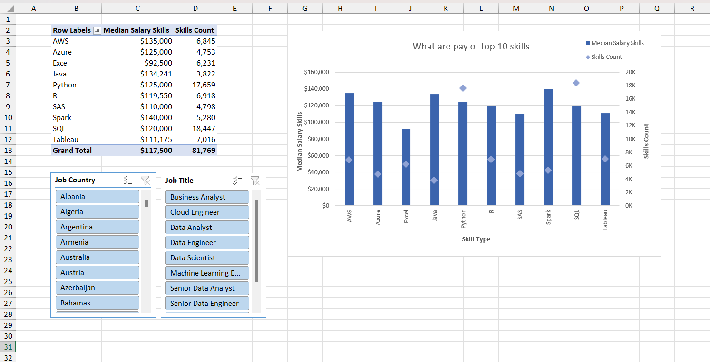

# 🔗 Skill Type vs Salary Analysis – Excel, Power Pivot & DAX CROSSFILTER

## 📊 Project Overview
This analysis explores how **different types of skills** relate to **skill median salary and skill demand** in the job market.

To achieve this, the data was **cleaned using Power Query** and modeled in **Power Pivot**.  
Because the relationship between the **skills table and salary table was not directly filterable in the required direction**, a **DAX CROSSFILTER function** was used to correctly propagate filters.

The results are visualized using a **Combo Chart** with interactive slicers, enabling users to explore insights by **country and job title**.

This project demonstrates **advanced Excel and DAX problem-solving techniques** used in real-world data analysis.

---

## 🎯 Business Objective
The objectives of this analysis are to:
- Analyze **skill median salary by skill type**
- Measure **skill demand using skill count**
- Overcome **data model filter direction limitations**
- Enable **interactive analysis** by country and job title
- Provide accurate insights for recruitment and skill planning

---

## 🛠 Tools & Technologies
- **Microsoft Excel**
  - Power Query – Data cleaning and transformation
  - Power Pivot – Data modeling
  - DAX – Advanced calculations (CROSSFILTER)
  - Pivot Tables & Pivot Charts
  - Slicers – Interactive filtering
- Data Analysis & Reporting

---

## 📊 Data Modeling & DAX Logic
### ⚠️ The Challenge
The data model included:
- A **skills table** (`skill_month`)
- A **salary table** (`job_salary_month_`)

By default, the filter direction **did not flow from skills to salary**, which prevented correct salary aggregation by skill.

---

### ✅ The Solution (The “Hack”)
To solve this, the **DAX `CROSSFILTER` function** was used inside explicit measures to **temporarily change the filter direction**.

This allowed:
- Skill selections to correctly filter salary data
- Accurate calculation of **skill median salaryby skill**
- Reliable aggregation of **skill count**

This approach ensures analytical correctness without altering the physical data model.

---

## 📈 Visualization & Analysis
The final insights are presented using a **Combo Chart**.

### Visualization Design
- **Chart Type:** Combo Chart (Column + Line)
- **X-Axis:** Skills
- **Primary Y-Axis:** Median Salary
- **Secondary Y-Axis:** Skill Count
- **Slicers:** Country, Job Title

This design enables users to **compare salary levels and skill demand simultaneously**.

---

## 🎛 Interactivity
- **Country slicer** filters results by region
- **Job Title slicer** allows role-specific analysis
- All metrics update dynamically based on slicer selections

This creates a **self-service, BI-style dashboard** inside Excel.

---

## 📸 Dashboard Preview

  

---

## 📌 Key Insights
- Shows how **different skill types impact salary**
- Identifies **high-value skills with strong demand**
- Demonstrates the importance of **correct filter context**
- Enables deep, flexible analysis without restructuring the model

---

## 🚀 How to Use
1. Open the Excel workbook
2. Go to the **Dashboard** or **Pivot Chart** sheet
3. Use slicers to filter by:
   - Country
   - Job Title
4. Review the combo chart to analyze **skill median salaryvs skill count by skill**

---

## 📌 Why This Project Matters
This project highlights my ability to:
- Solve **complex data model challenges**
- Use **advanced DAX (CROSSFILTER)** effectively
- Build **accurate, interactive dashboards**
- Explain technical solutions clearly to end users

