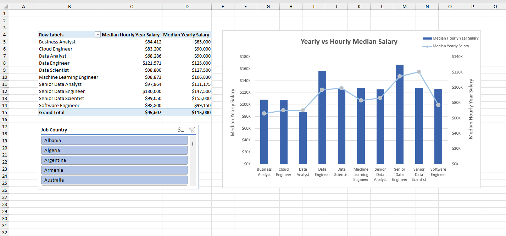

# 💰 Hourly vs Yearly Median Salary Comparison by Job Title (2023)

## 📊 Project Overview
This analysis compares **median yearly salaries** with **hourly-based median salaries (converted to yearly equivalent)** across different **job titles** using global job market data from **2023**.

The dataset was prepared using **Power Query** and analyzed using **Power Pivot**, enabling accurate aggregation and interactive filtering.  
A **Combo Chart** is used to visualize both salary metrics together, allowing users to clearly understand how **hourly and yearly compensation structures differ by role and country**.

This project demonstrates strong **Excel-based analytical and visualization skills**, commonly required for a **Data Analyst** role.

---

## 🎯 Business Objective
The goals of this analysis are to:
- Compare **hourly-based and yearly-based median salaries**
- Identify **salary structure differences by job title**
- Analyze compensation trends across countries
- Enable **interactive, user-driven exploration**
- Support **data-driven compensation benchmarking**

---

## 🛠 Tools & Technologies
- **Microsoft Excel**
  - Power Query – Data cleaning and transformation
  - Power Pivot – Data modeling and calculations
  - Pivot Tables & Pivot Charts
  - Combo Chart (Dual-Axis Visualization)
  - Slicers – Country-level filtering
- Data Analysis & Reporting

---

## 📊 Data Preparation & Modeling
1. Imported raw job salary data using **Power Query**
2. Cleaned and standardized:
   - Job titles
   - Salary fields
   - Country information
3. Loaded the data into the **Power Pivot data model**
4. Created measures for:
   - Median Yearly Salary
   - Median Hourly Salary (Yearly Equivalent)
5. Enabled **Country slicer** for regional analysis

This approach ensures **consistent metrics and accurate comparisons**.

---

## 📈 Visualization & Analysis

### Visualization Design
- **Chart Type:** Combo Chart (Column + Line)
- **X-Axis:** Job Title
- **Primary Y-Axis:** Median Yearly Salary
- **Secondary Y-Axis:** Median Hourly-Based Yearly Salary
- **Slicer:** Country

This visualization allows users to:
- Compare salary structures side by side
- Identify roles where hourly compensation differs significantly from yearly pay
- Analyze regional variations using the country slicer

---

## 🎛 Interactivity
- **Country slicer** filters salary data by region
- All salary metrics update dynamically
- Enables **self-service BI-style exploration**

---

## 📸 Dashboard Preview

  

---

## 🔍 Key Insights
- Highlights differences between **hourly and salaried compensation models**
- Reveals job roles where hourly pay translates to higher or lower yearly earnings
- Supports **compensation analysis, workforce planning, and market research**

---

## 📌 Skills Demonstrated
- Power Query ETL
- Power Pivot data modeling
- Salary aggregation and comparison
- Dual-axis visualization using Combo Charts
- Interactive dashboard design
- Business-focused insight generation

---

## 🚀 How to Use
1. Download and open the Excel workbook
2. Navigate to the **Dashboard** or **Pivot Chart** sheet
3. Use the **Country slicer** to filter results
4. Compare hourly vs yearly median salaries by job title
